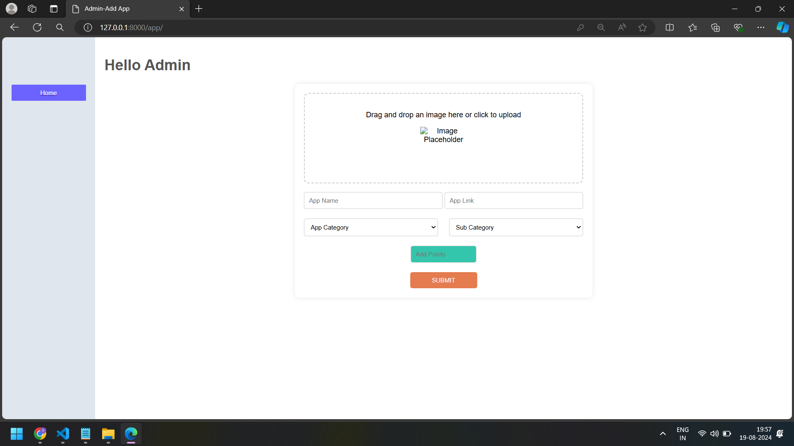

## Login

Admin and user both can login here if Admin loged in its goes to admin addding app section . If teh user loged in its goes to user interface. For login you can use this link [Login](https://shivunaanuu.pythonanywhere.com/).

## Admin
Username:admin  
Password:admin
The admin url is [admin](https://shivunaanuu.pythonanywhere.com/admin/)

## signup

By the credentials you can signup password and conform password should be the same orelse its shows error message.
After Signup also its show message at left top corner you can notice that.

## Admin interface

Only if the admin login can access this page orelse if the user loged in try to access thsi page "access denaied" message will pop up. So here admin can add thier apps and points to that apps.
[Admin_interface](https://shivunaanuu.pythonanywhere.com/app/)

## User app list

After loged in user can see the apps listed by admin and user points and task.
[]Task: Click on the task button at left sidebar its go to another page here if u want u can increase the point by clicking on the increses point button. Now user had a more points.
[]Points: Indivudual user have a their own points. user can see his points at top right of window.
[]logout:user can logout.
Click on view details. [app_list](https://shivunaanuu.pythonanywhere.com/app/interface/)

## app details

[app_description](https://shivunaanuu.pythonanywhere.com/app/details/2)
So here u can see about the app and as same as left side bar buttons and drag and drop for user can upload their screenshots.

## api view

[apiView](https://shivunaanuu.pythonanywhere.com/api/api_view/)
You can see the all the models present in this project and you can add new data to each fields. You can post the data here.

## api single_model

[Single_api](https://shivunaanuu.pythonanywhere.com/api/api_rud/2/) 
Here "2" is id for the model so each model have the individual id's so cahange the id's and u can see the data that you can edit that data or delete that data or entiare data set can be deleted.

## default admin
[default_admin](https://shivunaanuu.pythonanywhere.com/admin/)

